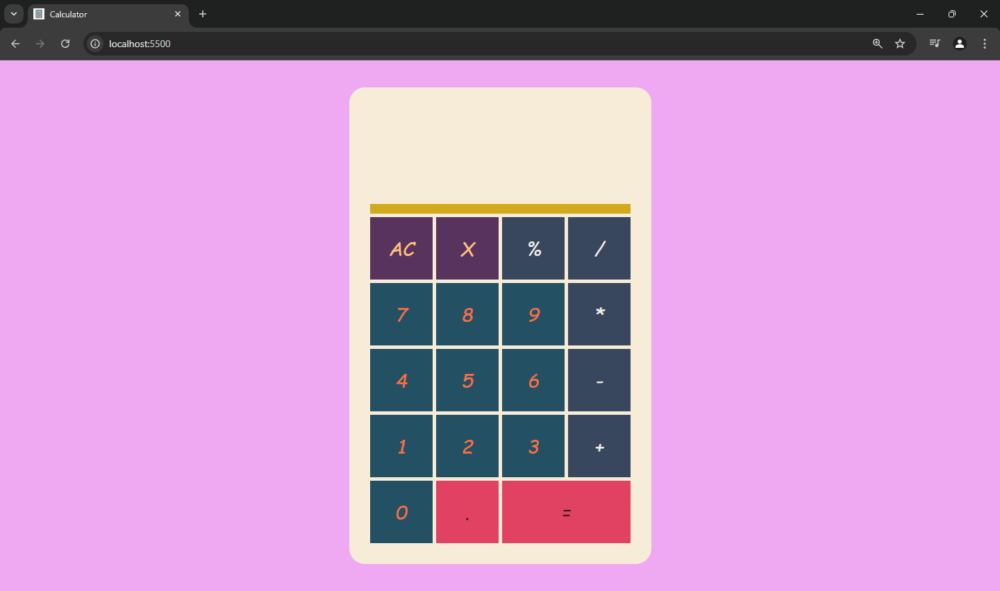

# Calculator

This is a simple and user-friendly calculator built with HTML, CSS, and JavaScript as part of the Odin Project. It offers basic arithmetic operations including addition, subtraction, multiplication, and division.

## Features

- Easy-to-use interface with clear buttons
- Large display for easy reading
- Supports decimal points
- Percentage calculation
- Backspace functionality to correct mistakes
- Clear button to reset the calculator

## Screenshot

## Getting Started

1. Clone or download the repository.
2. Open the `index.html` file in a web browser.
3. Start using the calculator!

## Usage Examples

Here are some examples of how to use the calculator:

- **Add 2 and 3:** Click the "2" button, then the "+" button, and then the "3" button. Finally, click the "=" button to see the result (5).
- **Divide 10 by 2:** Click the "1" button, then the "0" button, then the "/" button, then the "2" button, and lastly the "=" button to see the result (5).
- **Calculate 25% of 100:** Click the "2" button, then the "5" button, then the "%" button, then the "\*" button, and finally the "1" button followed by the "=" button. The result will be 25.

## Contributing

If you'd like to contribute to this project, feel free to fork the repository and submit a pull request with your changes. I welcome improvements and new features!

## Additional Notes

- This calculator is designed for basic mathematical operations.
- It does not support complex calculations or scientific notation.
- The display has a maximum length of 17 digits to prevent overflow.

## Acknowledgments

This project was completed as part of the Odin Project, a comprehensive curriculum for learning web development.

## Author

[Chetan M N](https://www.linkedin.com/in/chetan-m-n/)
